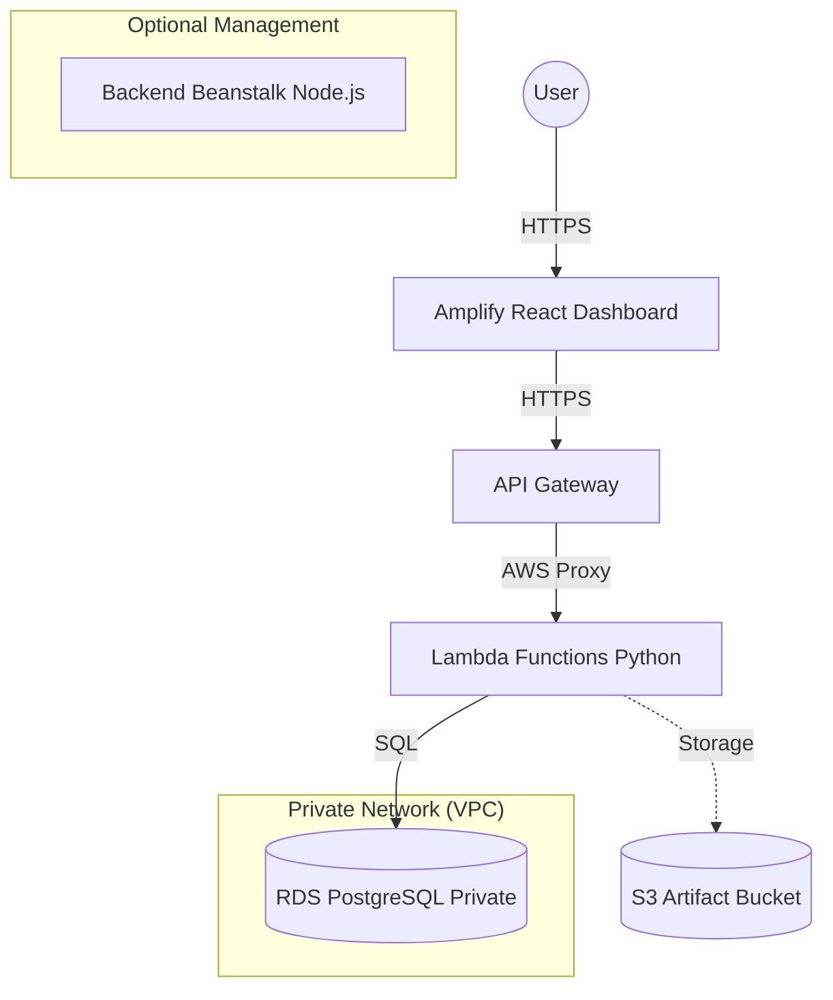

# 🚀 AWS Full-Stack Architecture — Dashboard Master Guide

Repository ini berisi arsitektur Full-Stack modern yang siap menampung ribuan request dengan skalabilitas tinggi, keamanan terjamin, dan otomatisasi CI/CD penuh menggunakan CloudFormation.

> [!IMPORTANT]
> **Tujuan:** Anda cukup melakukan `git clone`, mengisi *Secrets* di GitHub, dan semuanya akan ter-deploy secara otomatis.

---

## 📊 Arsitektur Sistem



### 📁 Teknologi yang Digunakan
*   **Web Console:** React & Vite (Hosted on AWS Amplify)
*   **Backend Serverless:** Python 3.12 (AWS Lambda)
*   **API Layer:** REST API (AWS API Gateway)
*   **Database:** PostgreSQL (AWS RDS Free Tier)
*   **Infrastructure:** CloudFormation (IaC)
*   **CI/CD:** GitHub Actions

---

## 🛠️ Langkah Cepat "Clone & Run"

### 1. Persiapan Akun & IAM
1. Buat IAM User di AWS Console (misal: `github-actions-user`).
2. Berikan izin `PowerUserAccess` dan `AdministratorAccess` (hanya untuk setup pertama kali).
3. Buat **Access Key ID** dan **Secret Access Key**.

### 2. Setup GitHub Secrets
Buka `Settings` -> `Secrets and variables` -> `Actions` di Repo GitHub Anda, tambahkan:

| Secret Name | Deskripsi |
|---|---|
| `AWS_ACCESS_KEY_ID` | Access Key ID dari User IAM |
| `AWS_SECRET_ACCESS_KEY` | Secret Access Key dari User IAM |
| `AWS_ACCOUNT_ID` | ID Akun AWS Anda (12 digit) |
| `DB_PASSWORD` | Password untuk RDS PostgreSQL |
| `AMPLIFY_APP_ID` | (Diisi setelah langkah 4) |
| `VITE_API_URL` | (Diisi setelah langkah 3) |

### 3. Deploy Infrastruktur (Otomatis)
Cukup `git push` ke branch `main`. Pipeline **"Deploy Infrastructure"** akan berjalan dan membuat VPC, RDS, Lambda, dan Gateway.

> [!TIP]
> Setelah Stack `myapp-apigateway` selesai, ambil **APIEndpoint** dari tab *Outputs* di CloudFormation. Masukkan URL tersebut ke GitHub Secret **`VITE_API_URL`**.

### 4. Setup Frontend (Amplify)
1. Hubungkan repo ini ke **AWS Amplify Console**.
2. Masukkan `AMPLIFY_APP_ID` yang dihasilkan ke GitHub Secrets.
3. Pastikan `VITE_API_URL` sudah terisi di **Environment Variables** Amplify Console.

---

## 📁 Struktur Root Folder
```text
├── .github/workflows/      # Otomatisasi CI/CD (GitHub Actions)
├── cloudformation/         # Definisi Infrastruktur (YAML)
├── frontend/               # Dashboard React + Vite
├── backend/                # Server Node.js (Optional Management)
└── lambda/                 # Logic Serverless (Python)
```

## 🧪 Cara Testing Lokal & Smoke Test
Setelah semua LIVE, Anda bisa menguji API Gateway secara langsung:

```bash
# Ganti URL dengan API Gateway URL Anda
API_URL="https://abcde123.execute-api.ap-southeast-1.amazonaws.com/v1"

# Simpan Data
curl -X POST "$API_URL/data" -H "Content-Type: application/json" -d '{"name":"tes-sensor","value":25.5,"category":"Test"}'

# Ambil Data
curl "$API_URL/data"
```

---

## 🛡️ Keamanan & Performa
*   **Keamanan:** Database RDS berada di **Private Subnet**, hanya bisa diakses oleh Lambda & Beanstalk.
*   **CORS Robustness:** Sudah dilengkapi `Gateway Responses` sehingga error 4xx/5xx tetap bisa terbaca oleh browser (tidak "Failed to fetch").
*   **Auto-Scaling:** API Gateway & Lambda menangani ribuan request secara otomatis tanpa perlu manajemen server.

---

## 🗑️ Menghapus Semua Resource (Destroy)
Jangan biarkan bill membengkak jika tidak digunakan!
1. Buka tab **Actions** di GitHub.
2. Jalankan workflow **"🗑️ Destroy Infrastructure"**.
3. Ketikkan **`DESTROY`** untuk konfirmasi. Semua resource akan dihapus bersih.

---
*Dibuat dengan ❤️ oleh Antigravity untuk arsitektur AWS yang lebih baik.*
